<div align="center">

<picture>
  <source media="(prefers-color-scheme: dark)" srcset="assets/header-dark.svg">
  <source media="(prefers-color-scheme: light)" srcset="assets/header-light.svg">
  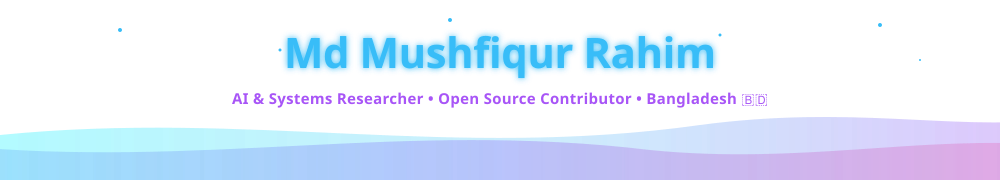
</picture>

</div>

<div align="center">

[](https://github.com/MD-Mushfiqur123)

<br/>

[](https://github.com/MD-Mushfiqur123)
&nbsp;
[](https://github.com/MD-Mushfiqur123)
&nbsp;
[](https://github.com/MD-Mushfiqur123?tab=repositories&sort=stargazers)
&nbsp;
[](https://buymeacoffee.com/mdmushfiqur123)

</div>

---

<table border="0" width="100%">
<tr>
<td width="55%" valign="top">

### `> whoami`

```yaml
identity:
  name      : "Md Mushfiqur Rahim"
  role      : "SOO & Lead AI/ML Engineer @ Craftly"
  age       : 16
  location  : "Bogura, Bangladesh 🇧🇩"
  education : "HSC '28 Science | Govt. Azizul Haque College"

focus:
  flagship  : "Mission Mlych — 1.3B Custom SLM"
  dataset   : "Building the World's Largest Bangla LLM Dataset (Craftly Corpus)"
  research  :
    - "World's Largest Curated Bangla Pre-training Dataset"
    - "High-performance AI model architectures & tokenizers"
    - "M-2LRF (2-bit Low-Rank Factorization)"
    - "Shadow-Omni: Multimodal vision-speech-text stream reasoning"
    - "Aero-Propulsion telemetry physics simulations"

impact:
  merged_prs : 108+ across 66+ global organizations
  downloads  : 40,000+ on HuggingFace (DropLychee)
  public_repos: 520+
```

</td>
<td width="45%" align="center" valign="middle">


<br/><br/>

<i>"Throughout heaven and earth,<br/>continuous innovation alone is honored."</i>

<br/><br/>

[](https://github.com/MD-Mushfiqur123)
[](mailto:20mahin2020@gmail.com)
<br/>
[](https://huggingface.co/DropLychee)
[](https://huggingface.co/MD-Mushfiqur123)
<br/>
[](https://leetcode.com/u/mushfiqurH2B/)
[](https://facebook.com/100090048324727)

</td>
</tr>
</table>

---

## 🌟 Open Source Infrastructure Contributions

> Production contributions merged into industry-critical systems:

<div align="center">

| Project | Domain | Scale |
| :--- | :--- | :---: |
| 🐳 **[Docker — moby/moby](https://github.com/moby/moby)** | Core Container Runtime Engine | 69.8k ⭐ |
| 🔍 **[Google — google/go-cmp](https://github.com/google/go-cmp)** | Official Go Equality & Diff Package | 4.1k ⭐ |
| ☁️ **[AWS Labs — awslabs/mcp](https://github.com/awslabs/mcp)** | Model Context Protocol for AWS Infra | AWS Official |
| 📊 **[CNCF — prometheus/client_golang](https://github.com/prometheus/client_golang)** | Cloud-Native Metrics & Monitoring | 5.3k ⭐ |
| ⚙️ **[CNCF — etcd-io/raft](https://github.com/etcd-io/raft)** | Kubernetes Core Raft Consensus | 4.8k ⭐ |
| ⚡ **[GoFiber — gofiber/fiber](https://github.com/gofiber/fiber)** | Ultra-fast Express-inspired Go Framework | 35.5k ⭐ |
| 🐚 **[Oh My Zsh — ohmyzsh/ohmyzsh](https://github.com/ohmyzsh/ohmyzsh)** | World's Most Popular CLI Framework | 175k ⭐ |
| 🗄️ **[ClickHouse — clickhouse-go](https://github.com/ClickHouse/clickhouse-go)** | Real-time Analytical Database Driver | 1.8k ⭐ |

</div>

---

## 🛠️ Mastered Technologies & Engineering Sectors

<div align="center">

#### 💻 Programming Languages & Systems
<a href="https://skillicons.dev">
  
</a>

<br/>

#### 🧠 Artificial Intelligence, Machine Learning & Vision
<a href="https://skillicons.dev">
  
</a>

<br/>

#### 🌐 Full-Stack Web Architecture & Frameworks
<a href="https://skillicons.dev">
  
</a>

<br/>

#### ☁️ Cloud Platforms, DevOps & Containerization
<a href="https://skillicons.dev">
  
</a>

<br/>

#### 🗄️ Database Systems, In-Memory & Streaming
<a href="https://skillicons.dev">
  
</a>

<br/>

#### ⚡ Developer Tooling, CI/CD & Version Control
<a href="https://skillicons.dev">
  
</a>

</div>

---

## ⚡ GitHub Metrics & Analytics

<div align="center">

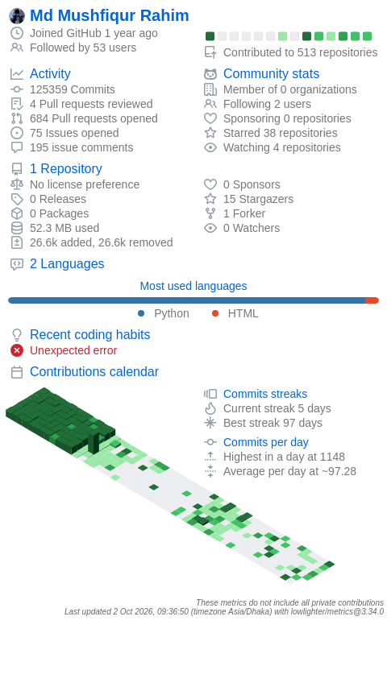

</div>

---

## 🗺️ 3D Contribution Landscape

<div align="center">

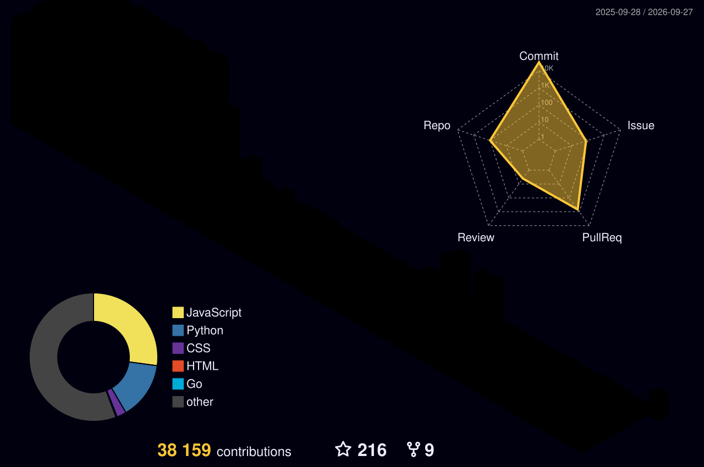

</div>

---

---

## 🌲 Living Minecraft Contribution Biome

<div align="center">

<a href="https://github.com/MD-Mushfiqur123">
  
</a>

</div>

---

## 🟢 Cyber Matrix Contribution Rain

<div align="center">

<picture>
  <source media="(prefers-color-scheme: dark)" srcset="https://raw.githubusercontent.com/MD-Mushfiqur123/MD-Mushfiqur123/output/matrix-rain-v2-dark.svg">
  <source media="(prefers-color-scheme: light)" srcset="https://raw.githubusercontent.com/MD-Mushfiqur123/MD-Mushfiqur123/output/matrix-rain-v2-light.svg">
  
</picture>

</div>

## 🐍 Contribution Snake

<div align="center">

<picture>
  <source media="(prefers-color-scheme: dark)"  srcset="https://raw.githubusercontent.com/MD-Mushfiqur123/MD-Mushfiqur123/output/github-snake-dark.svg" />
  <source media="(prefers-color-scheme: light)" srcset="https://raw.githubusercontent.com/MD-Mushfiqur123/MD-Mushfiqur123/output/github-snake-light.svg" />
  
</picture>

</div>

---

## 🏆 GitHub Trophies & Milestones

<div align="center">

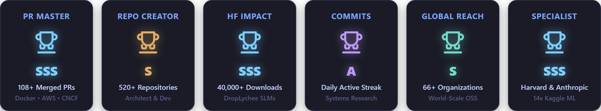

<br/><br/>

[](https://github.com/MD-Mushfiqur123)

</div>

---

## 👾 Pacman Devourer & Matrix Contribution Track

<div align="center">



</div>

---

## 📈 30-Day Contribution Pulse Line Graph

<div align="center">



</div>

---

## ✍️ Dev Wisdom

<div align="center">

[](https://github.com/piyushsuthar/github-readme-quotes)

</div>

---

## 🎓 Verified Certifications & Credentials

### 🏛️ Top Universities & Global Computer Science Programs

<table border="0" width="100%">
  <tr>
    <td width="50%" align="center" valign="top">
      <a href="https://cs50.harvard.edu/certificates/9fde6ff7-e81e-4c04-89cf-735b736004dd">
        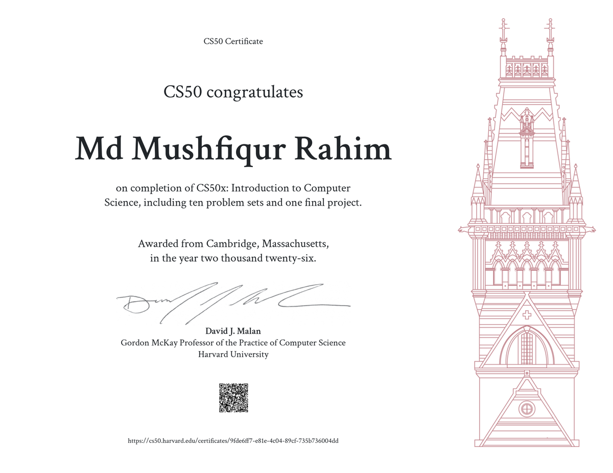
      </a>
      <br/><br/>
      <a href="https://cs50.harvard.edu/certificates/9fde6ff7-e81e-4c04-89cf-735b736004dd">
        
      </a>
    </td>
    <td width="50%" align="center" valign="top">
      <a href="https://studies.cs.helsinki.fi/stats/api/certificate/fullstackopen/en/2459f5ce85ad3bee10459f37870e8c84">
        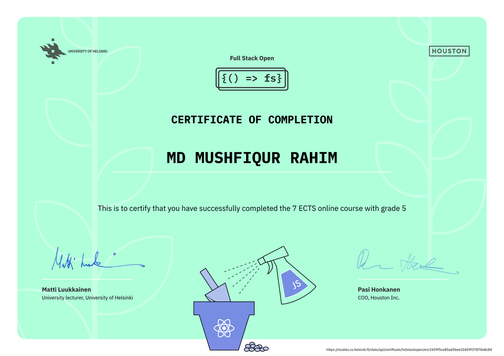
      </a>
      <br/><br/>
      <a href="https://studies.cs.helsinki.fi/stats/api/certificate/fullstackopen/en/2459f5ce85ad3bee10459f37870e8c84">
        
      </a>
    </td>
  </tr>
  <tr>
    <td width="50%" align="center" valign="top">
      <a href="https://certificates.mooc.fi/validate/1xw084tnsab">
        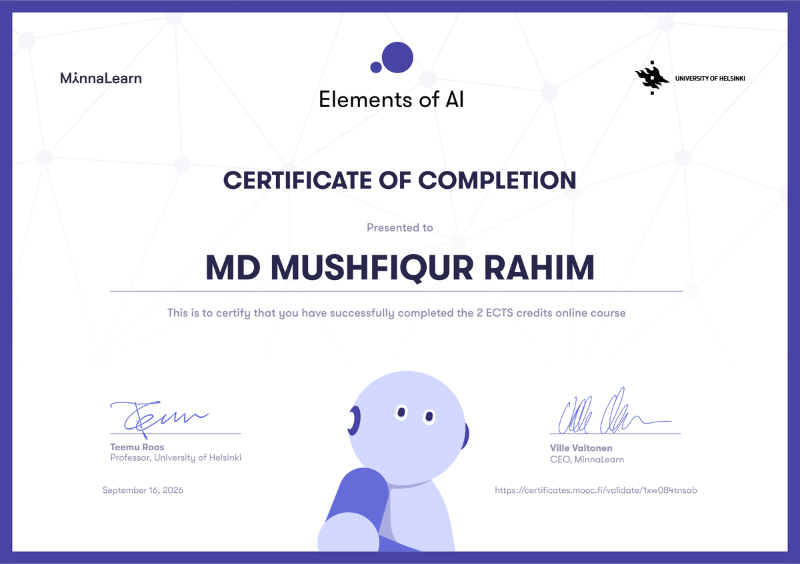
      </a>
      <br/><br/>
      <a href="https://certificates.mooc.fi/validate/1xw084tnsab">
        
      </a>
    </td>
    <td width="50%" align="center" valign="top">
      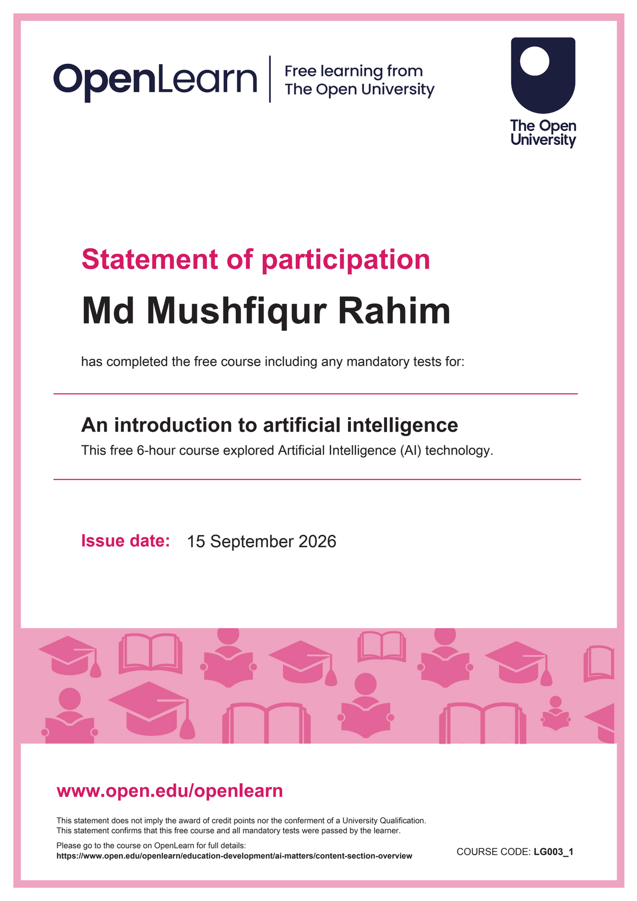
      <br/><br/>
      
    </td>
  </tr>
</table>

<br/>

### 🤖 Anthropic AI — Certified Developer

<div align="center">

| Certificate | Issuer | Verification |
| :--- | :--- | :---: |
| **Claude Code in Action** | Anthropic | [↗ View Credential](https://verify.skilljar.com/c/qp3mi4hhbpdk) |
| **Claude with Google Vertex AI** | Anthropic | [↗ View Credential](https://verify.skilljar.com/c/6euhyoyfxevg) |
| **Claude 101** | Anthropic | ✅ Verified |
| **Claude Code 101** | Anthropic | ✅ Verified |
| **AI Fluency for Students** | Anthropic × UCC × Ringling × HEA | ✅ Verified |
| **AI Fluency: Framework & Foundations** | Anthropic × UCC × Ringling × HEA | ✅ Verified |

</div>

<br/>

### 🌐 Official Qualifications & Accreditations

<table border="0" width="100%">
  <tr>
    <td width="42%" align="center" valign="middle">
      <a href="https://cert.efset.org/G7yoSe">
        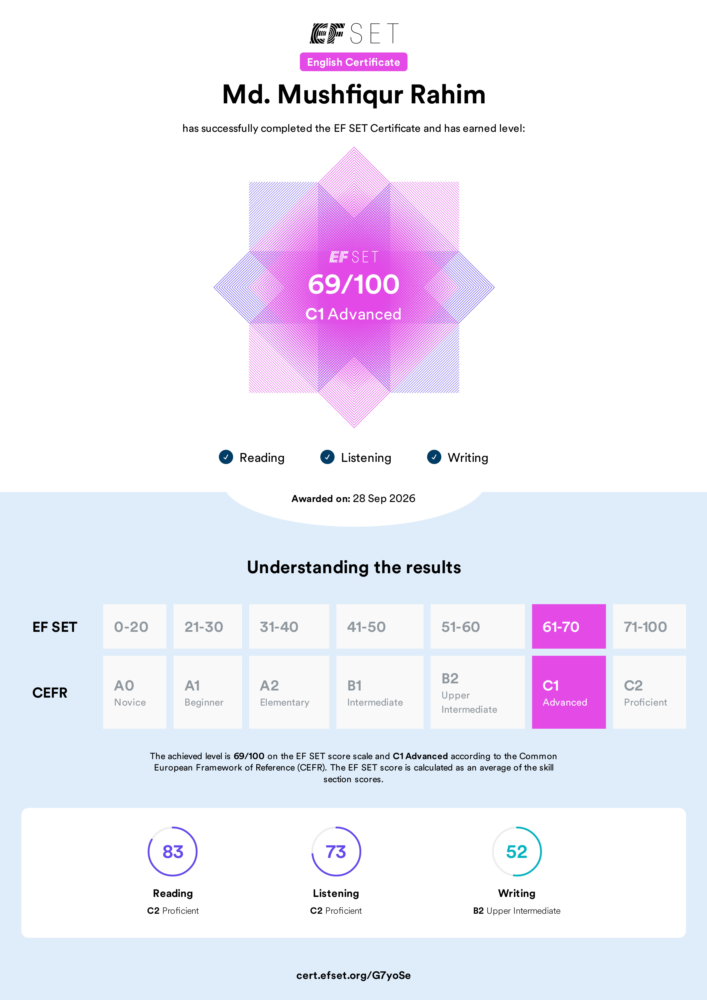
      </a>
      <br/><br/>
      <a href="https://cert.efset.org/G7yoSe"></a>
    </td>
    <td width="58%" align="center" valign="middle">
      <a href="https://www.skills.google/public_profiles/f65660d4-2a1e-48ba-8431-998055be793a">
        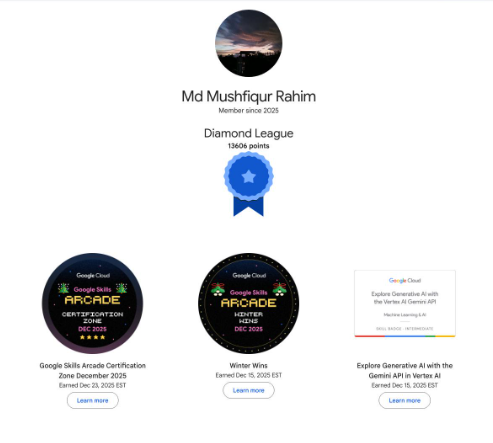
      </a>
      <br/><br/>
      <a href="https://www.skills.google/public_profiles/f65660d4-2a1e-48ba-8431-998055be793a"></a>
    </td>
  </tr>
</table>

<br/>

### ⚡ LeetCode — Algorithmic Mastery & Official Study Plan Badges

<div align="center">

<a href="https://leetcode.com/u/mushfiqurH2B/">
  
</a>
<a href="https://leetcode.com/u/mushfiqurH2B/">
  
</a>
<a href="https://leetcode.com/u/mushfiqurH2B/">
  
</a>
<a href="https://leetcode.com/u/mushfiqurH2B/">
  
</a>
<a href="https://leetcode.com/u/mushfiqurH2B/">
  
</a>

<br/><br/>

<table border="0" width="100%">
  <tr>
    <td width="25%" align="center" valign="top">
      <a href="https://leetcode.com/u/mushfiqurH2B/">
        
      </a>
      <br/><br/>
      <a href="https://leetcode.com/u/mushfiqurH2B/"></a>
    </td>
    <td width="25%" align="center" valign="top">
      <a href="https://leetcode.com/u/mushfiqurH2B/">
        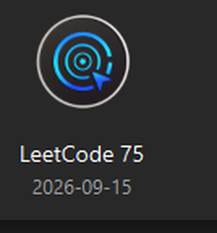
      </a>
      <br/><br/>
      <a href="https://leetcode.com/u/mushfiqurH2B/"></a>
    </td>
    <td width="25%" align="center" valign="top">
      <a href="https://leetcode.com/u/mushfiqurH2B/">
        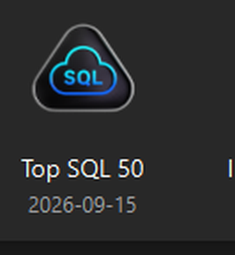
      </a>
      <br/><br/>
      <a href="https://leetcode.com/u/mushfiqurH2B/"></a>
    </td>
    <td width="25%" align="center" valign="top">
      <a href="https://leetcode.com/u/mushfiqurH2B/">
        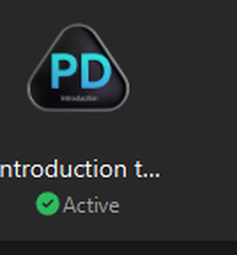
      </a>
      <br/><br/>
      <a href="https://leetcode.com/u/mushfiqurH2B/"></a>
    </td>
  </tr>
</table>

</div>

<br/>

### 🧠 Google & Kaggle — Machine Learning & AI Specializations

<table border="0" width="100%">
  <tr>
    <td width="50%" align="center">
      
    </td>
    <td width="50%" align="center">
      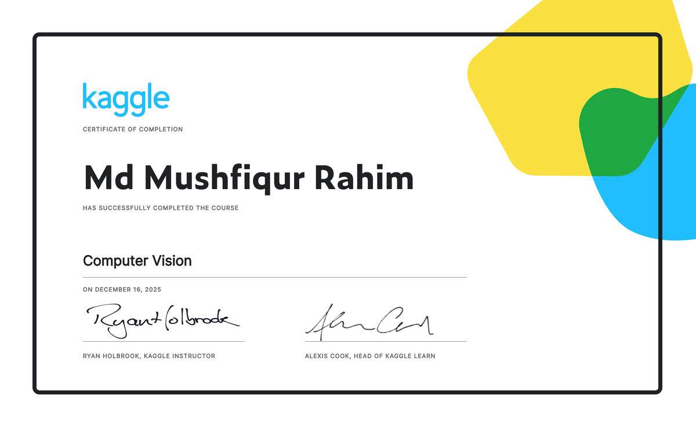
    </td>
  </tr>
  <tr>
    <td width="50%" align="center">
      
    </td>
    <td width="50%" align="center">
      
    </td>
  </tr>
  <tr>
    <td width="50%" align="center">
      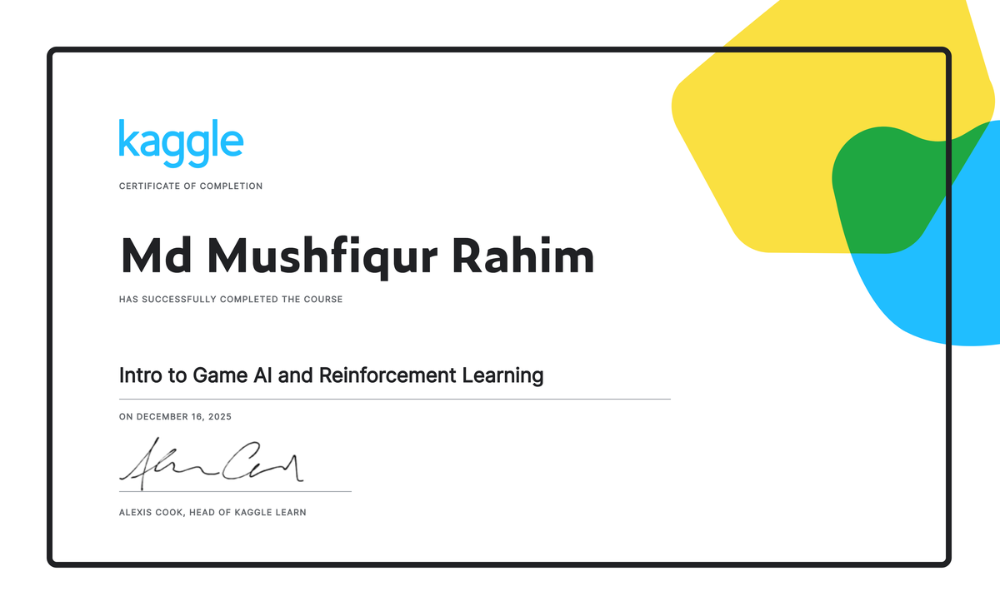
    </td>
    <td width="50%" align="center">
      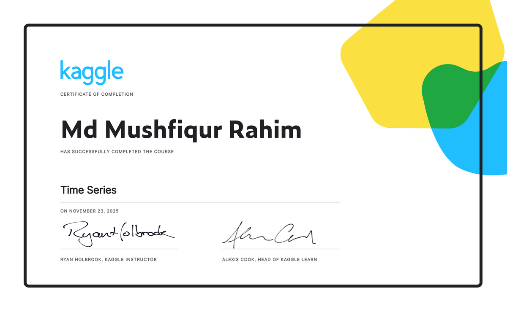
    </td>
  </tr>
  <tr>
    <td width="50%" align="center">
      
    </td>
    <td width="50%" align="center">
      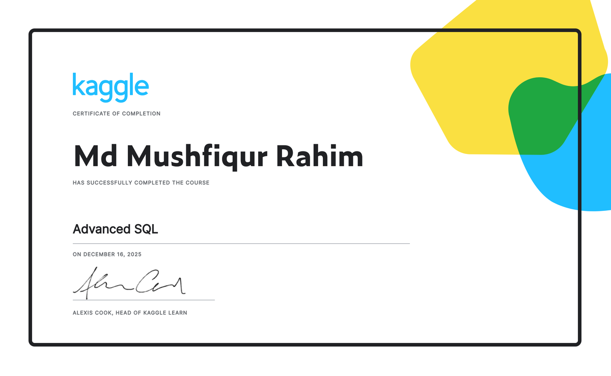
    </td>
  </tr>
  <tr>
    <td width="50%" align="center">
      
    </td>
    <td width="50%" align="center">
      
    </td>
  </tr>
  <tr>
    <td width="50%" align="center">
      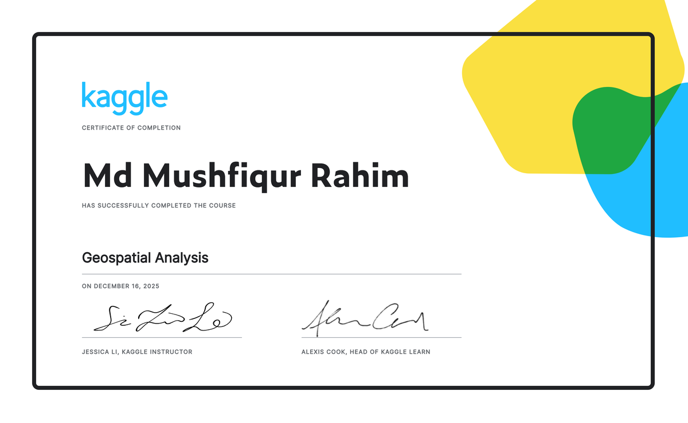
    </td>
    <td width="50%" align="center">
      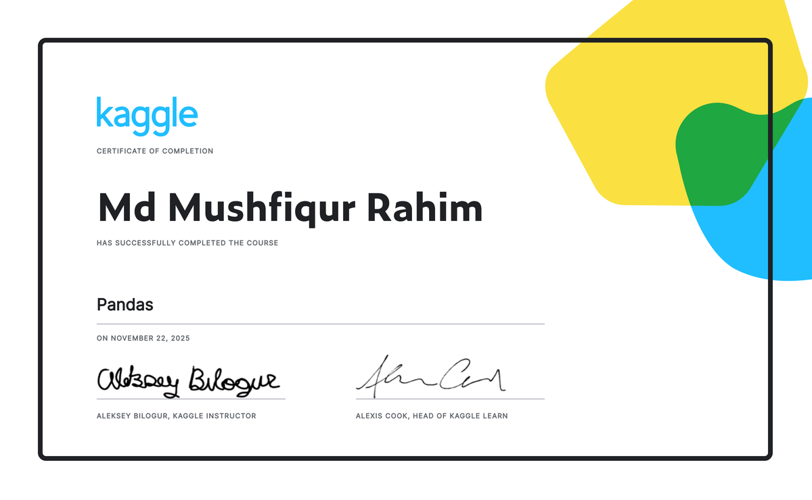
    </td>
  </tr>
  <tr>
    <td width="50%" align="center">
      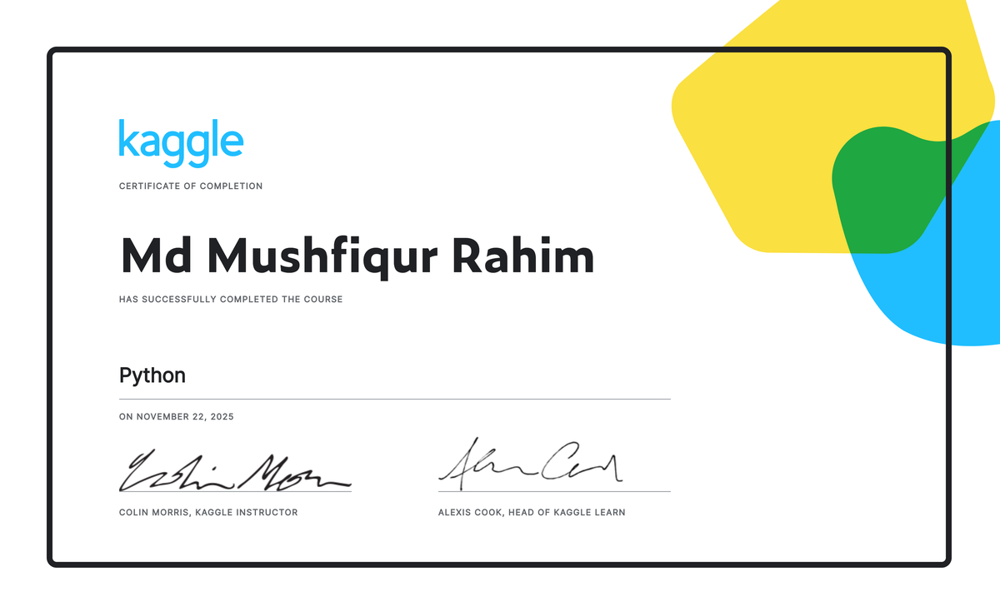
    </td>
    <td width="50%" align="center">
      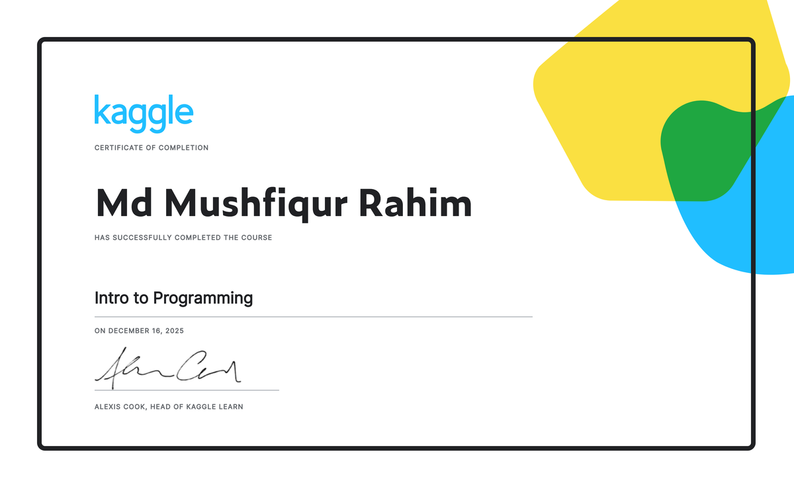
    </td>
  </tr>
</table>

---

<div align="center">

<picture>
  <source media="(prefers-color-scheme: dark)" srcset="assets/header-dark.svg">
  <source media="(prefers-color-scheme: light)" srcset="assets/header-light.svg">
  
</picture>

</div>
